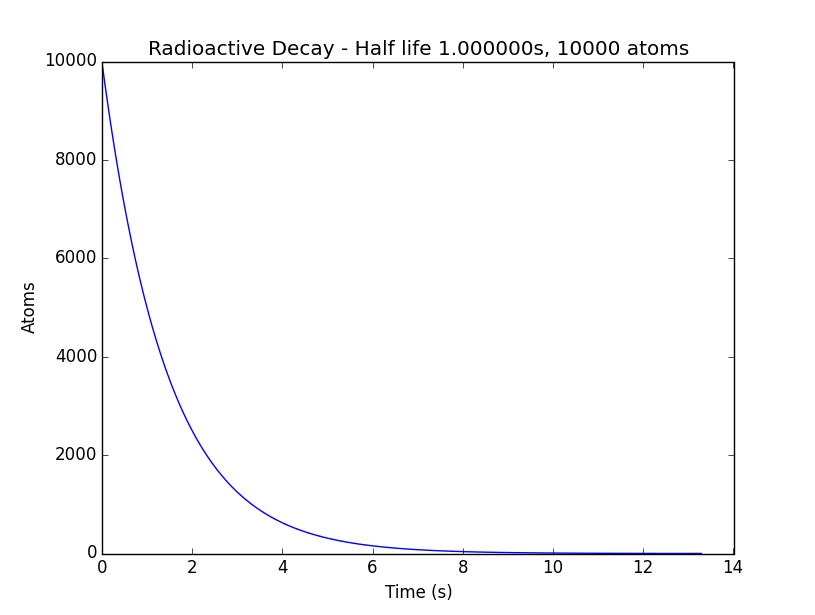

# radioactive-decay.py

A small python script that will plot a graph of radioactive decay, given a half-life and a number of atoms.

Initially, the decay constant (λ) is calculated by doing `λ = ln(2) / half-life`. Then, the number of atoms remaining is calculated using `N = N0 * e ^ (-λt)` where N0 is the initial number of atoms, λ is the decay constant, and t is the time elapsed.

A graph is then plotted using matplotlib, and looks something like this:

Using 64-bit Python is recommended, or memory runs out very quickly.